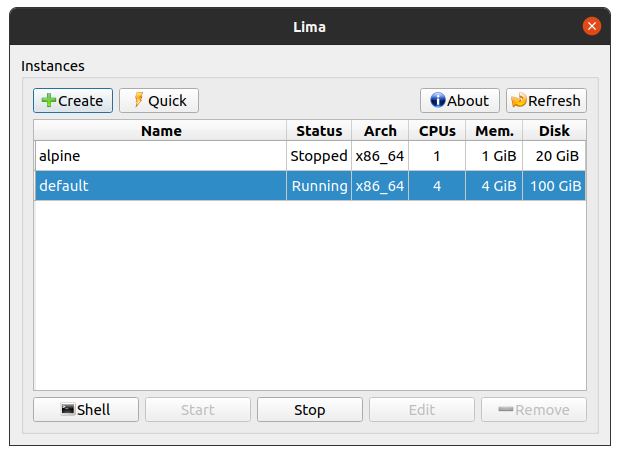
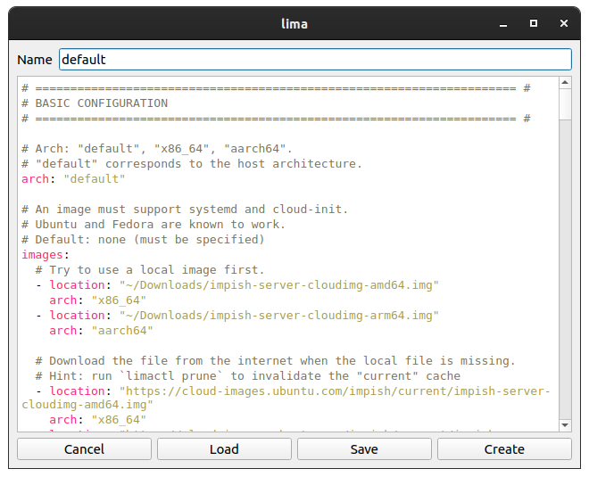
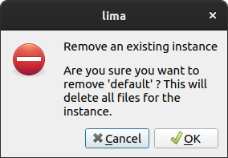
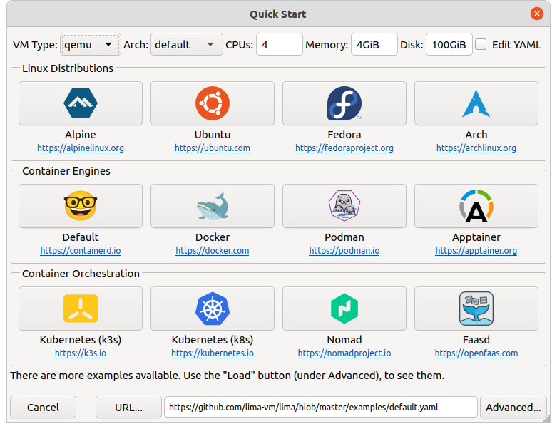
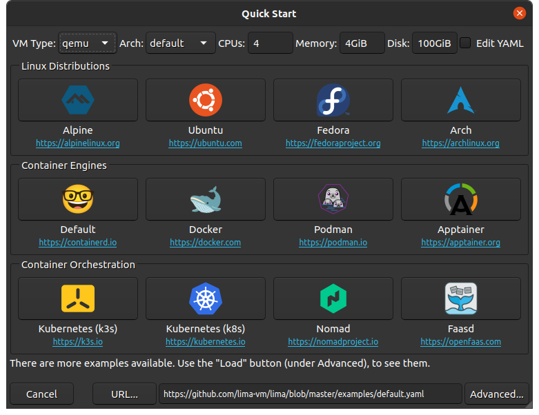

# Lima GUI

See <https://lima-vm.io>

## Running

Open in [Qt Creator](https://doc.qt.io/qtcreator/) GUI:

```shell
qtcreator systray.pro
```

Or on the command line:

```console
$ qmake
$ make
...
$ ./lima-gui
```

## Screenshots

### Main window



#### Create



#### Remove



### Themes

You can use [Kvantum](https://github.com/tsujan/Kvantum), for theme support.
It has several themes:





`QT_STYLE_OVERRIDE=kvantum` (or use `kvantummanager` GUI)

----

See <https://doc.qt.io/qt-5/qtwidgets-desktop-systray-example.html>

Tux icon from the Crystal project by Everaldo Coelho.
The icons are licensed under the GNU Lesser General Public License (LGPL).

## Optional

These features are optional, and can be disabled or enabled in build:

* QTermWidget (default: off) <https://github.com/lxqt/qtermwidget>
* QrwEmoticons (default: on) <https://github.com/raven-worx/qrwemoticons>
* QSourceHighlite (default: on) <https://github.com/Waqar144/QSourceHighlite>
* QVNCClient (default: on) <https://bitbucket.org/amahta/qvncclient>

The QTermWidget has a GPL-2+ license, and is not included by default.

The default is to start the regular terminal application, externally.
